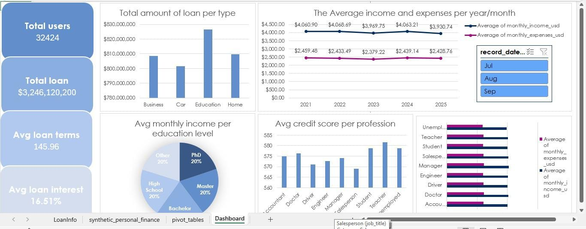

# synthetic_personal_finance_dataset-analysis-with-Excel

## 📊 Project Overview
This project analyzes the [Synthetic Personal Finance Dataset](https://www.kaggle.com/datasets/miadul/synthetic-personal-finance-dataset) from Kaggle.  
The goal was to clean and transform the data, create key financial measures, and design an interactive Excel dashboard for loan insights.

---

## 🛠 Tools Used
- **Microsoft Excel**
  - Power Query for data cleaning & transformation
  - Power Pivot for data modeling & calculations
  - Pivot Tables & Charts for visualizations

---

## 🔍 Steps Taken
1. **Data Cleaning with Power Query**
   - Split the main dataset into two tables:
     - **Loans Table**: Loan-related details
     - **Customer Info Table**: Other customer details
   - This reduced `NULL` and `0` values in unrelated columns.
   - Checked column quality, corrected data types, and ensured accuracy.

2. **Data Modeling with Power Pivot**
   - Created relationships between the two tables.
   - Built general measures:
     - Average Income
     - Average Loan Interest
     - Total Loan Amount

3. **Visualization**
   - Designed an interactive dashboard in Excel.
   - Visual elements include:
     - Average loan interest
     - Total loans overview
     - Income vs. expenses distribution
    

---

## 📷 Dashboard Preview

---

## 📈 Key Insights
- Identified patterns in loan distribution based on income and interest rate.
- Reduced redundancy by splitting the dataset into logical tables.

---

## 📂 Project Structure
